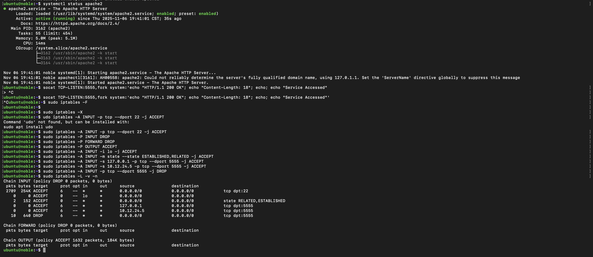
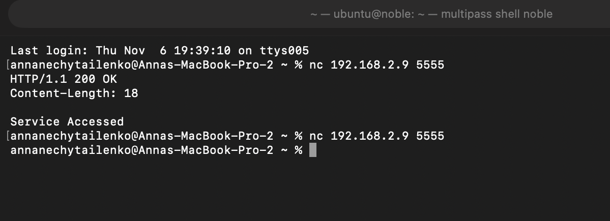

# Report practice 09

## Task 1

### Task 1.1

**Requirement:** 

- 351 usable host IPs (350 clients + 1 router)
- Router IP = 10.3.115.1

-- 1) Determine CIDR prefix

2^9−2=510 →  9 bits host portion 

CIDR prefix = 32−9=/23

-- 2) Calculate ip addresses for network,  broadcast , usable range:

Given router IP = 10.3.115.1 in /23 block:

    Network: 10.3.114.0/23

    Broadcast: 10.3.115.255

    Usable range: 10.3.114.1 to 10.3.115.254

### Task 1.2:

**Requirement:**

- Exactly 80 devices (including router) → 80 usable IPs
- Router IP = 172.16.50.10

-- 1) Determine CIDR prefix

2^7−2=126 → 7 bits host portion

CIDR prefix = 32−7=/25 

-- 2) Calculate ip addresses for network,  broadcast , usable range:

Given router IP = 172.16.50.10 in /25 block:

    Network: 172.16.50.0/25

    Broadcast: 172.16.50.127

    Usable range: 172.16.50.1 – 172.16.50.126

### Task 1.3:

**Requirement:**

- 15 devices (including router) → 15 usable IPs
- Router IP = 192.168.1.137

-- 1) Determine CIDR prefix

2^5−2=30 → 5 bits host portion

CIDR  prefix= 32−5=/2732−5=/27.

-- 2) Calculate ip addresses for network,  broadcast , usable range:

Given router IP = 192.168.1.137 in /27 block:

    Network Address: 192.168.1.136

    Broadcast Address: 192.168.1.159

    Usable IP Range: 192.168.1.137 – 192.168.1.158

## Task 2:

[terminal_VM](terminal_output/practice09_VM.txt)

[terminal_host](terminal_output/terminal_output_practice09_host.txt)