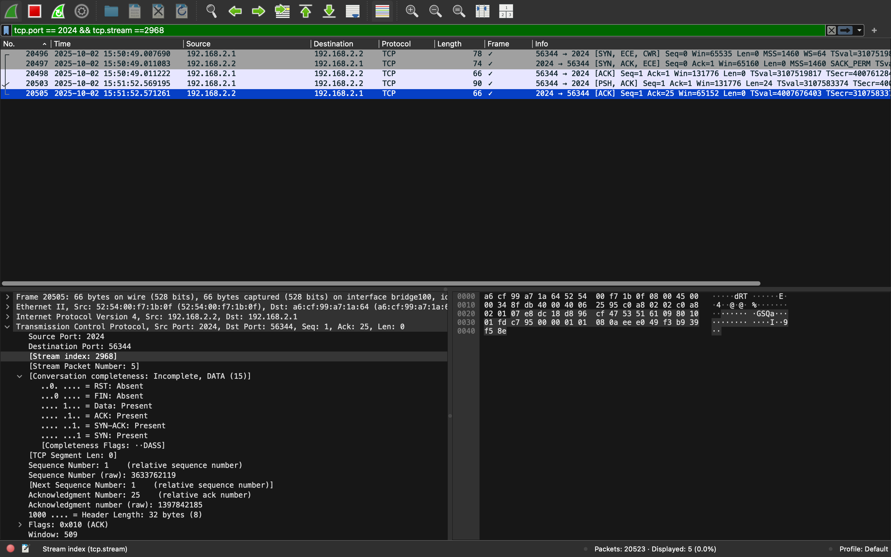
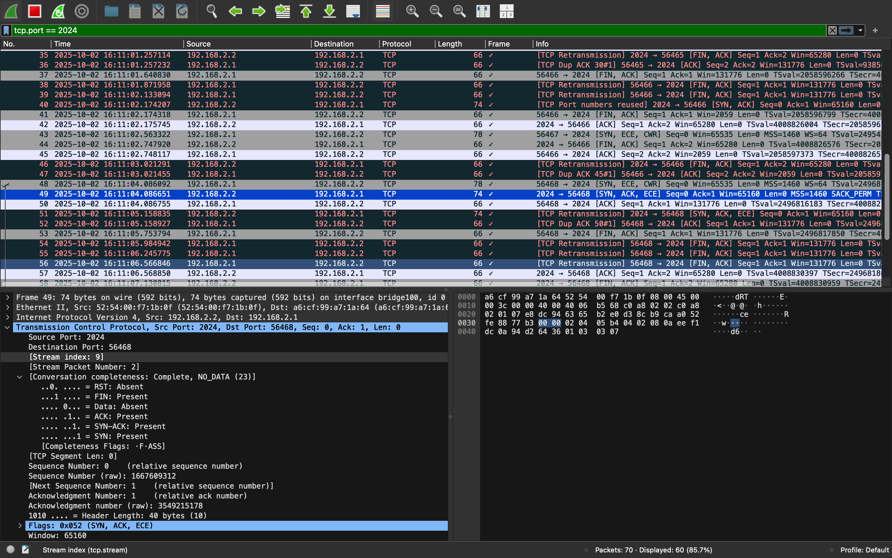
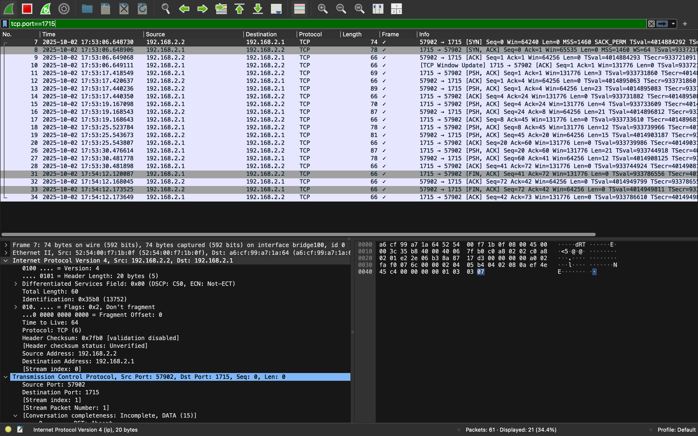
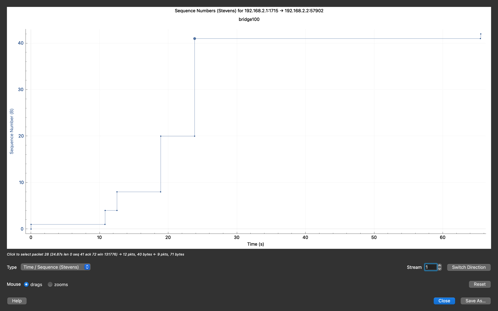

### Practice04

# Warm_up tasks

# Knowledge experiment 

[Terminal_output](/terminal_output/warm_up.txt)

# Warm-up

[Terminal_output](./terminal_output/warm_up_2.txt)

Observe  the process of port mapping

# Task1

[Terminal_output_client](./terminal_output/client_part_task1.txt)

[Terminal_output_server](./terminal_output/server_part_task01.txt)

[Data.txt](./data.txt)

[command_server.sh](./command_server.sh)

# Task 2

[Terminal_output_client](./terminal_output/client_part_task2.txt)

[Terminal_output_server](./terminal_output/server_part_task2.txt)

# Task 3

Done and shownn during the class 

# Task 4

[Terminal_output_client](./terminal_output/vm_server_part_task04.txt)

[Terminal_output_server](./terminal_output/host_client_part_task04.txt)

Screen of strean index of session

Screen of dropped connection 

# Additional 

[Terminal_output_target](./terminal_output/VM_target.txt)

[Terminal_output_attacker](./terminal_output/host_attacker.txt)

Screen of TCP communication

TCP Stream Graphs for time-sequence visualization
