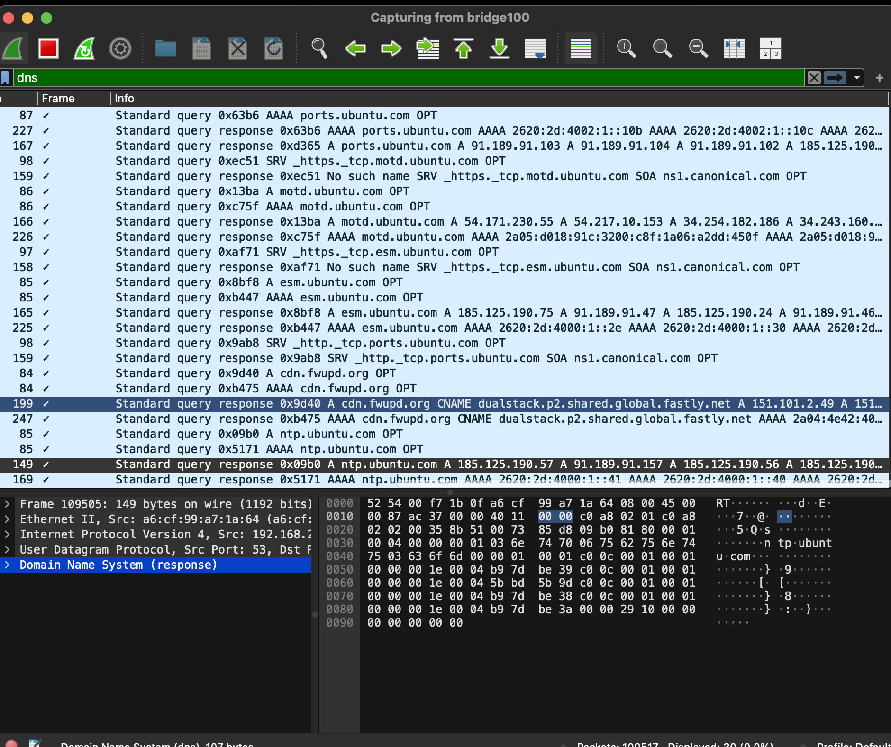
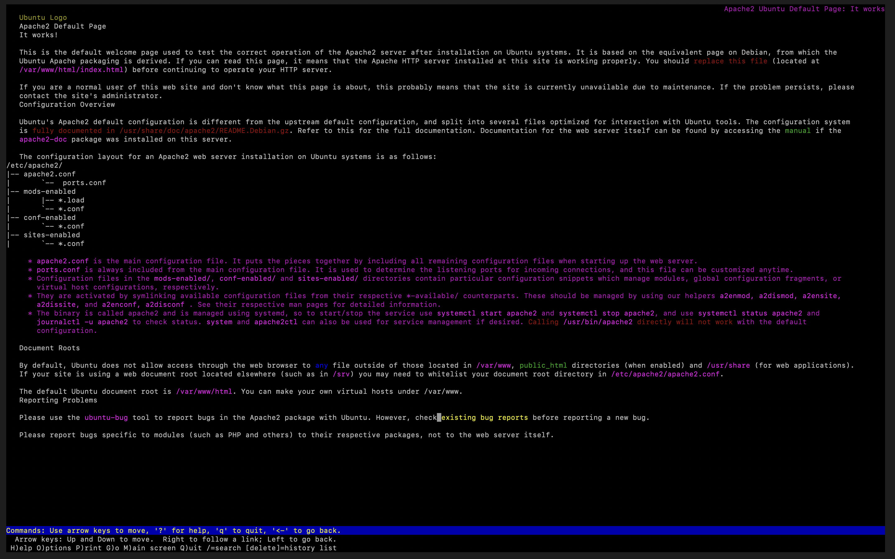
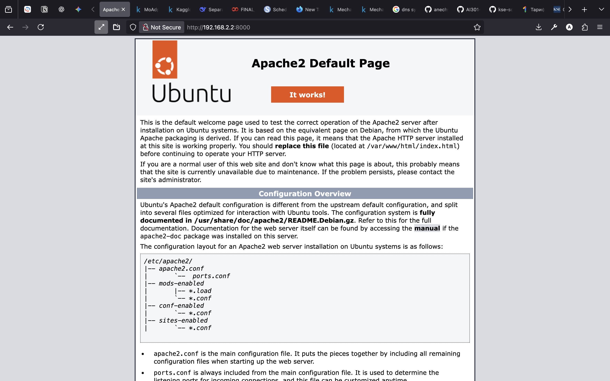
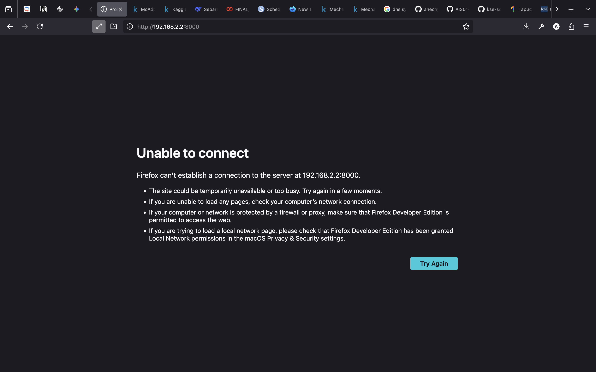
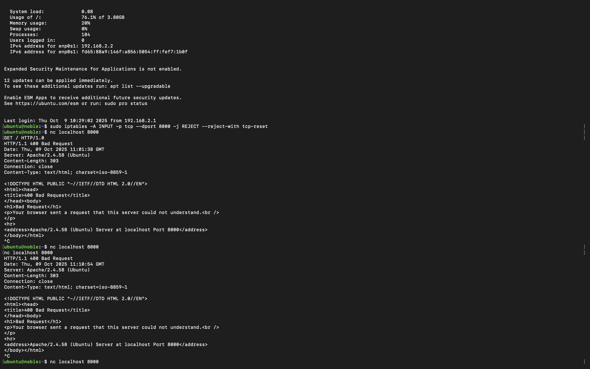
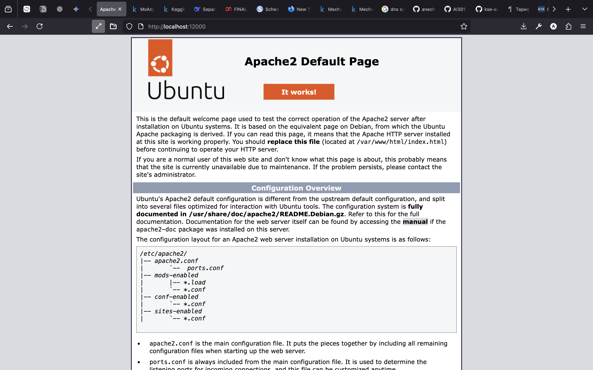
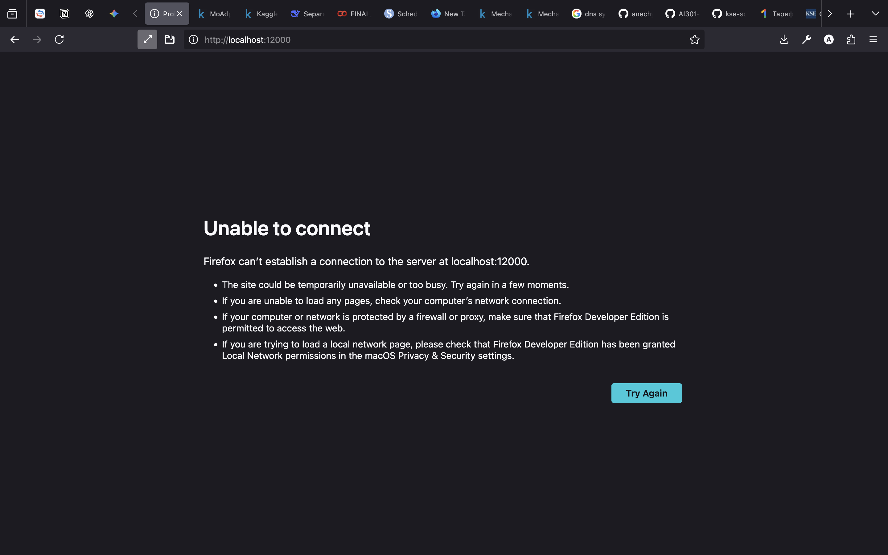
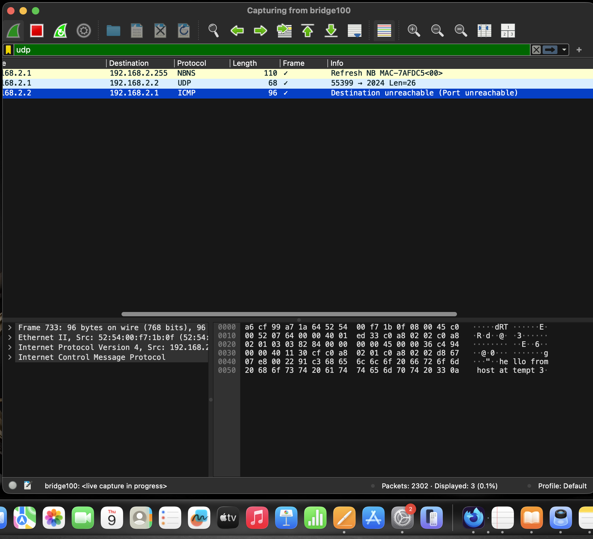

# Practice 5

## Warn-up

[terminal_00](./termainal_outputs/terminal_00.txt)

## Task1

[terminal_01](./termainal_outputs/terminal_01.txt)

## Task2

[terminal_02_host](./termainal_outputs/terminal_02_host.txt)

[terminal_02_vm](./termainal_outputs/terminal_02_vm.txt)

## Task3

[terminal_03_helperVM](./termainal_outputs/terminal_03_helperVM.txt)

[terminal_03_noble](./termainal_outputs/terminal_03_noble.txt)

## Task5

[terminal_04_host](./termainal_outputs/terminal_04_host.txt)

[terminal_04_noble](./termainal_outputs/terminal_04_noble.txt)