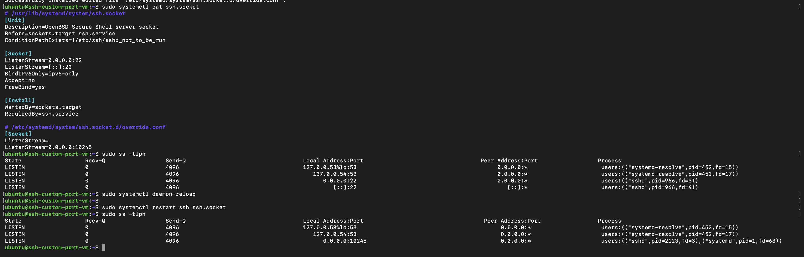
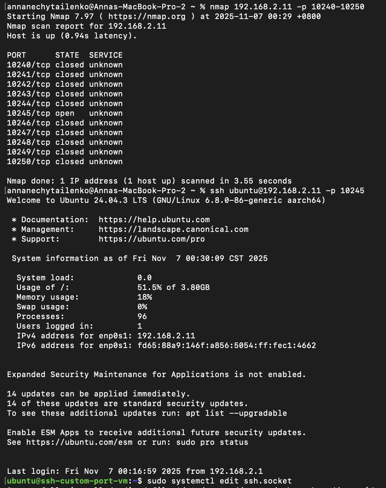
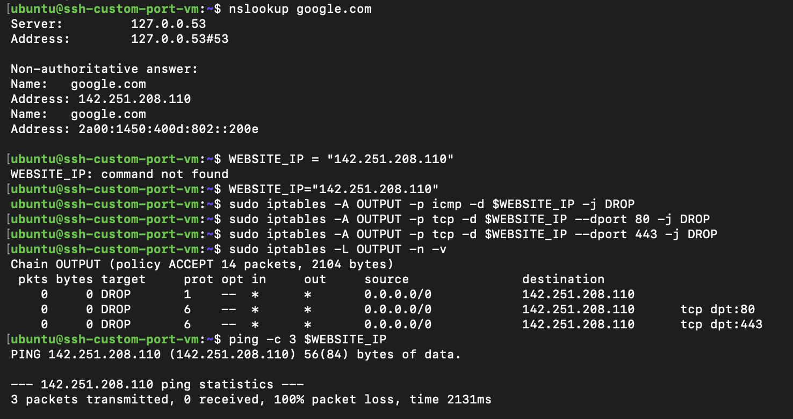
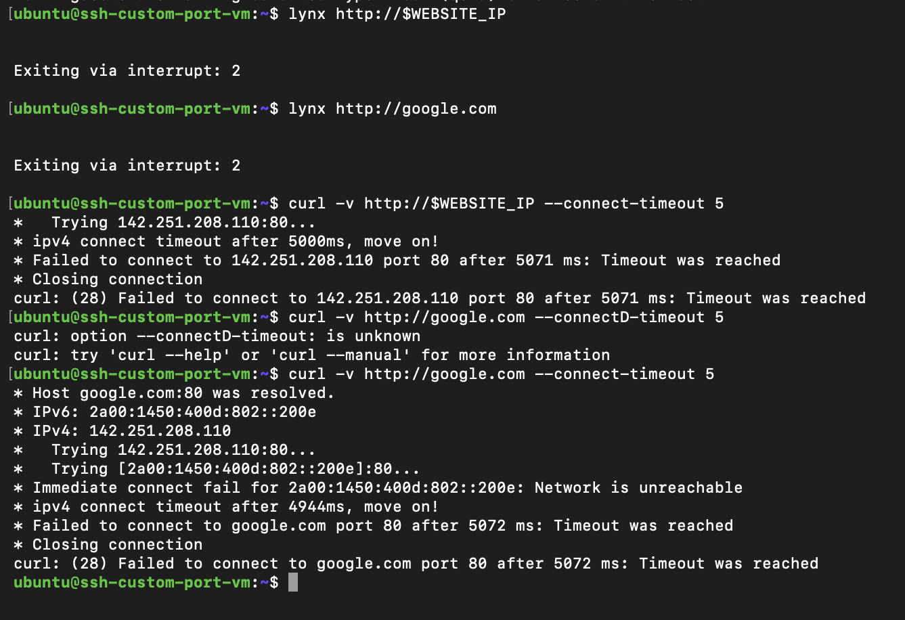

## Task01:

- change ssh

## Task02:

- iptables 

------------ Loopback Interface

- Interface Name: lo (loopback)

- Status: UP,LOWER_UP - Interface is active and connected

- MTU: 65536 (Maximum Transmission Unit)

- MAC Address: 00:00:00:00:00:00 (special loopback address)

- IPv4 Address: 127.0.0.1/8 (localhost)

- IPv6 Address: ::1/128 (IPv6 localhost)

- Purpose: Internal communication within the same machine

----------- Ethernet Network Interface name

- Status: BROADCAST,MULTICAST,UP,LOWER_UP - Interface can send to multiple devices, is active and physically connected

- MAC Address: 52:54:00:c1:46:62 (Physical hardware address)

- Broadcast MAC: ff:ff:ff:ff:ff:ff 

- IPv4 : 192.168.2.11

- IPv6 Global Address: fd65:88a9:146f:a856:5054:ff:fec1:4662/64 (Unique internet-routable IPv6 address)

- IPv6 Global Type: dynamic mngtmpaddr noprefixroute (Temporary privacy address)

- IPv6 Global Lifetime: 2591953 seconds valid, 604753 seconds preferred (~30 days total, ~7 days preferred)

- IPv6 Link-Local Address: fe80::5054:ff:fec1:4662/64 (Local network communication only)
