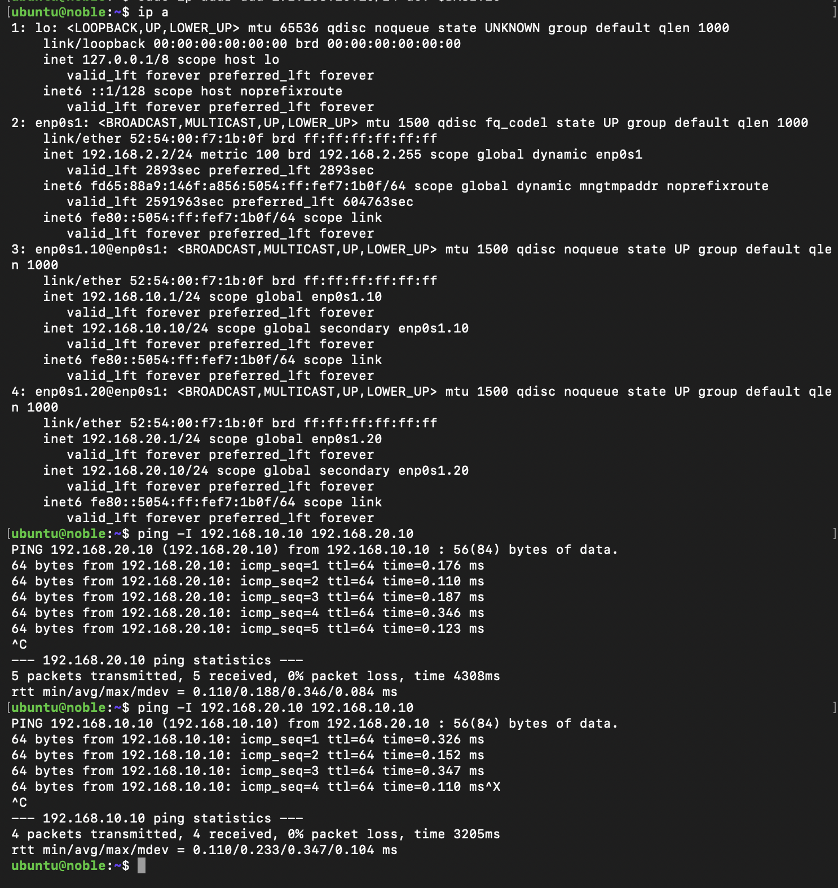
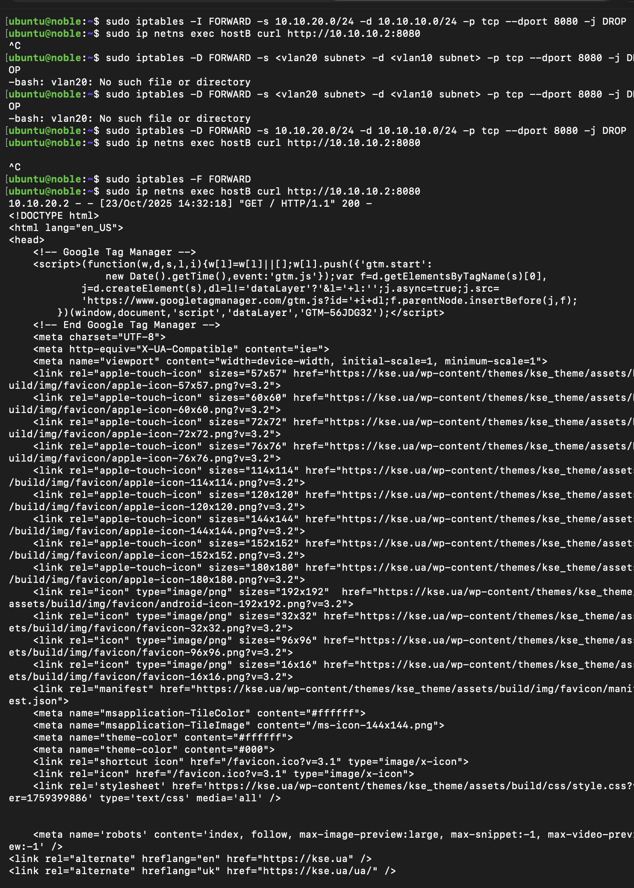
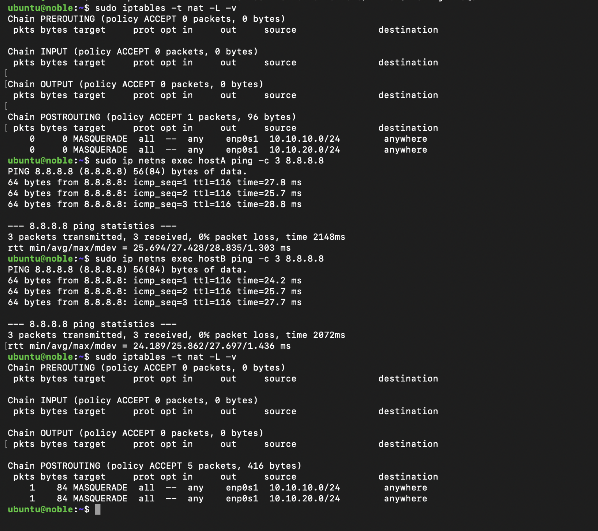

# Practice 07

## Task01

Goal : VLANs within one VM (secondary IPs as simulated hosts)

[terminal](terminals_outputs/practice07_task01_terminal.txt)

## Task02

Goal: emulate two isolated VLANs as independent L2 segments, connect them to your Linux system acting as a router, assign gateway IPs on bridges, and enable L3 forwarding between VLANs.

[terminal](terminals_outputs/practice07_task02_trminal.txt)

## Task03:

Goal: configure NAT so that both VLAN subnets can access the Internet via your VM’s main external interface (e.g., enp0s3 or other interface depending on the host OS).

[terminal](terminals_outputs/practice07_task_03_terminal.txt)