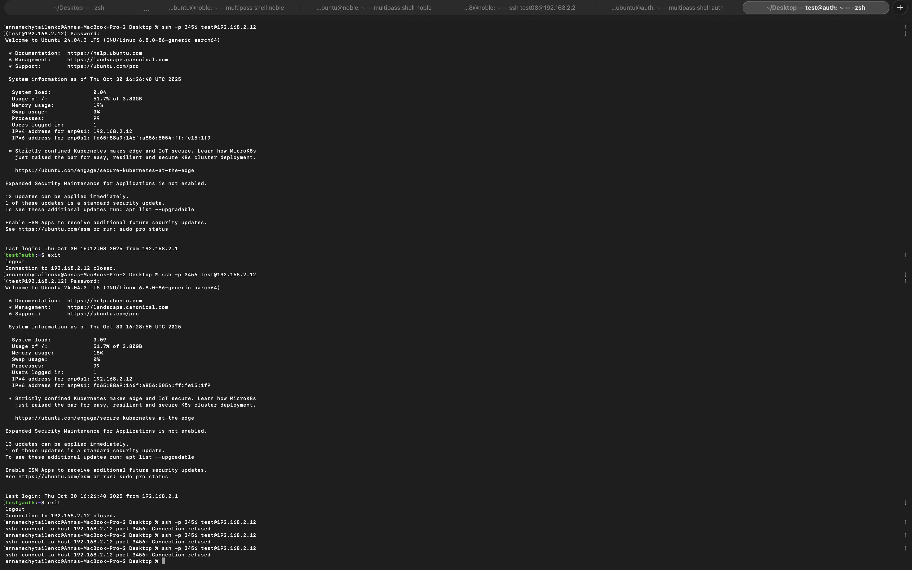
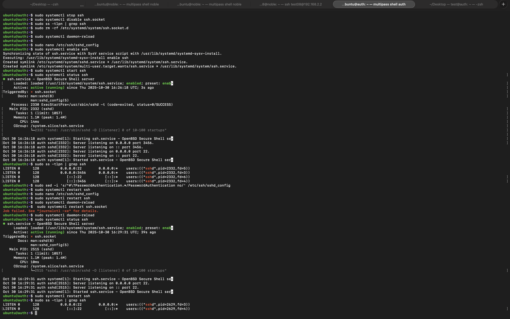

# Report practice 08

## Warm-up

- Goal: learn tldr and  grep functionality
[terminal_output_01](./terminals_output/terminal_practice_08_task_01.txt)
## Task01:

- Goal: to enable ssh connectionto the user through password

## Task02:

-  Goal practice tldr, cut, sort, uniq, grep, find

[terninal_output](./terminals_output/terminal_output_practice08_task03.txt)