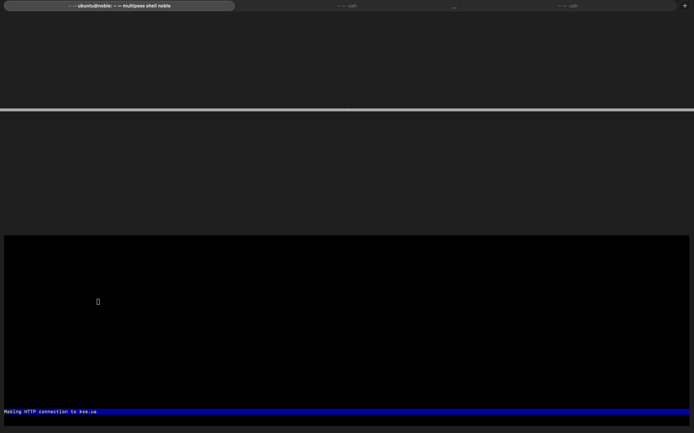
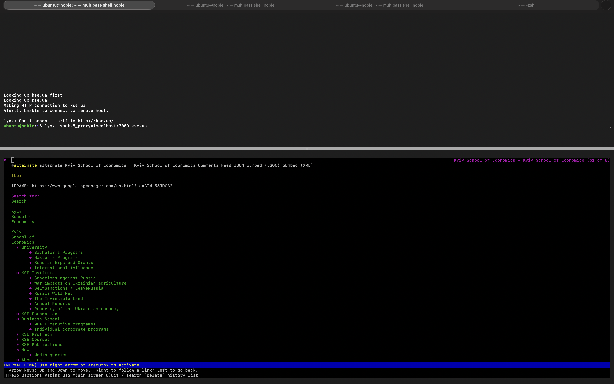
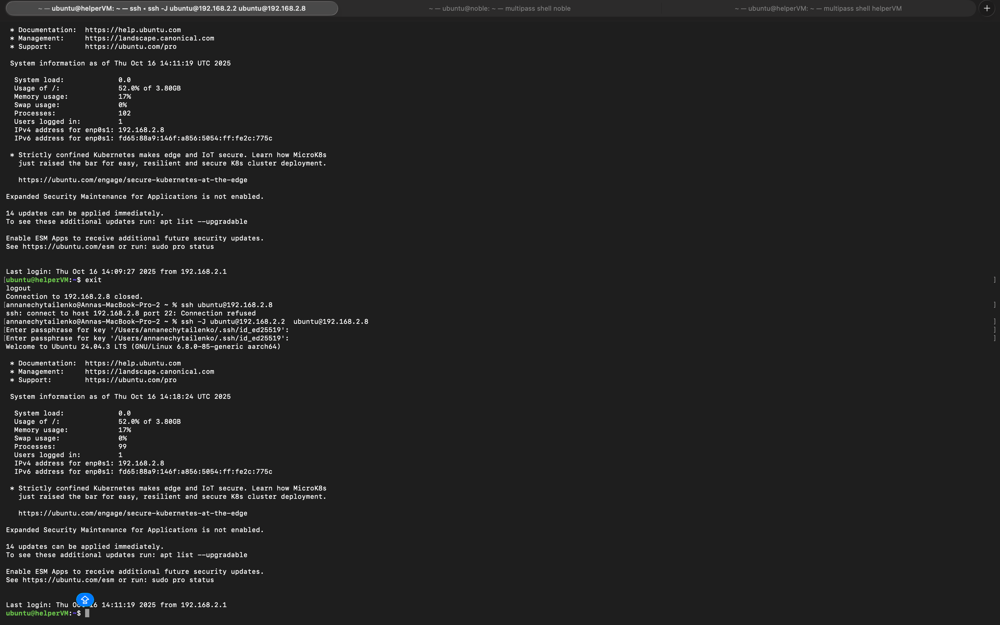
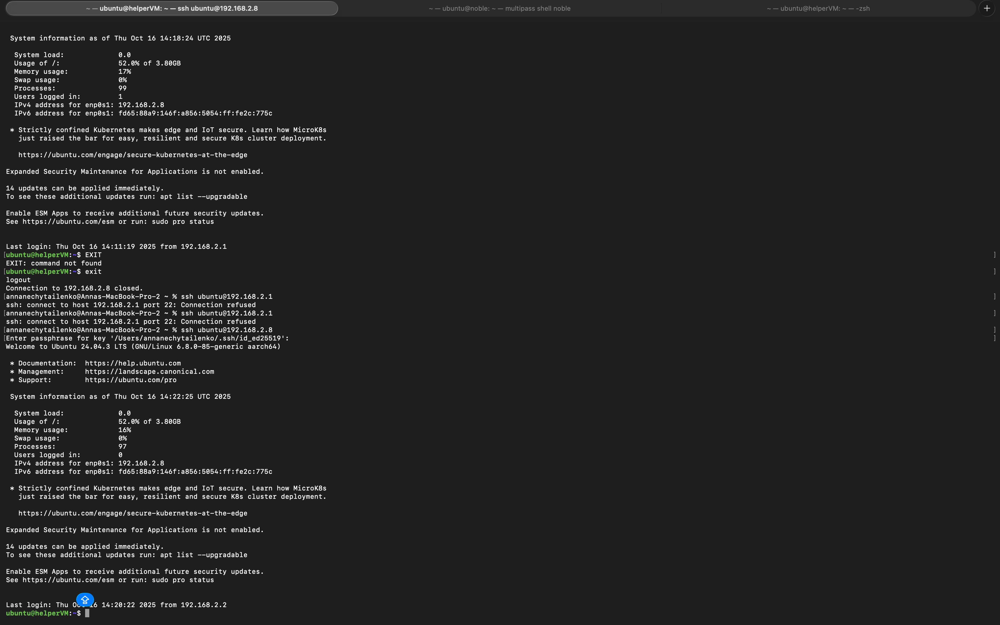
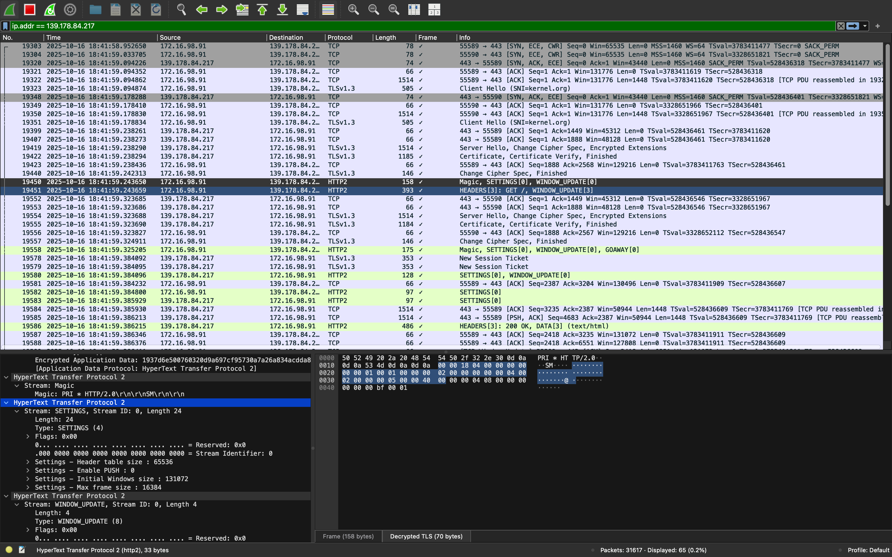
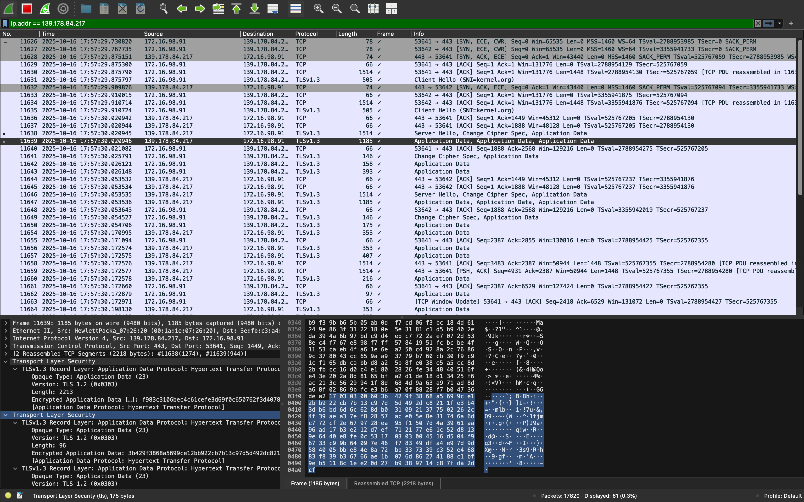

# Practice 06

## Warm -up

[Terminal_output_vm_0](teminalOutput/terminal_output_host_warmUp.txt)

[Terminal_output_host_0](teminalOutput/terminal_output_vm_warmUp.txt)

## Task 1

[Terminal_output_vm_1](teminalOutput/terminal_outout_01_noble.txt)

[Terminal_output_host_1](teminalOutput/terminal_output_01_helperVM.txt)

## Task 2

[Terminal_output_vm_2](teminalOutput/terminal_output_noble_task03.txt)

[Terminal_output_host_2](teminalOutput/terminal_output_host_task_03.txt)

[Terminal_output_helperVM_2](teminalOutput/terminal_output_helperVM_03.txt)

## Task 3

[Terminal_output_host_3](teminalOutput/terminal_output_task3.txt)

